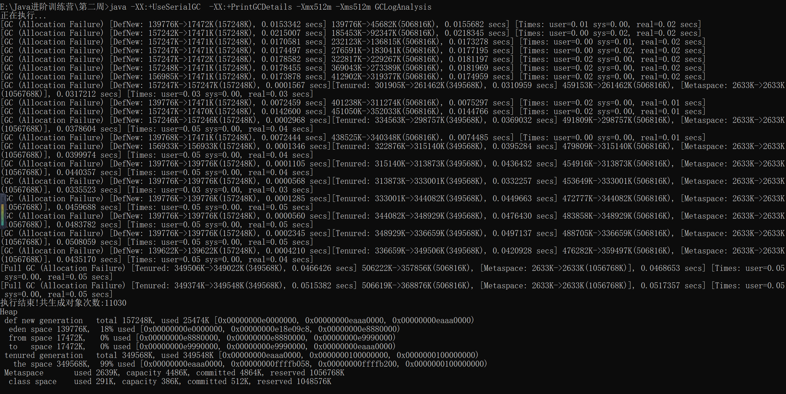
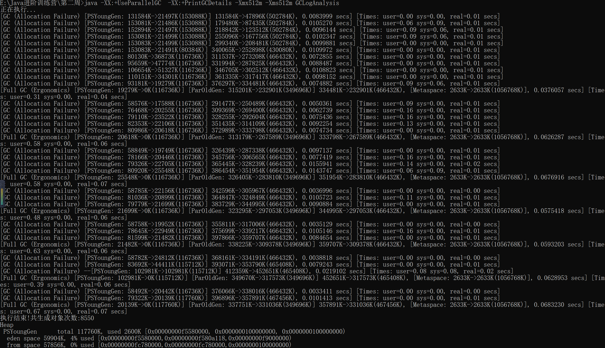
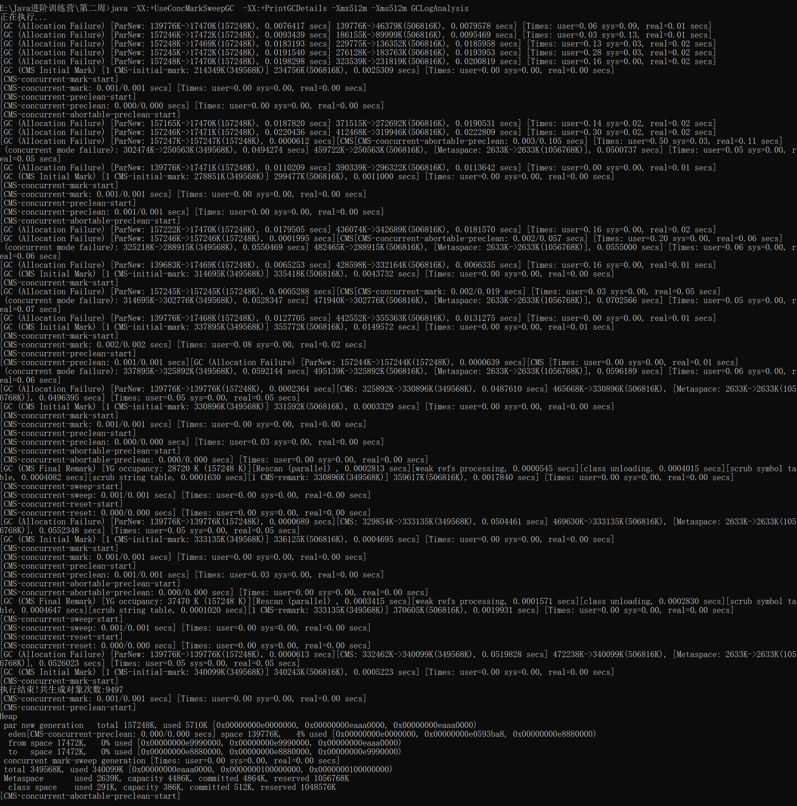
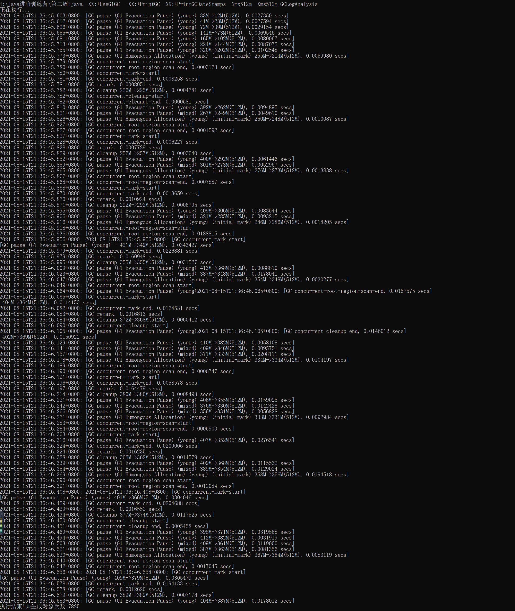

# 总结

**串行GC**：由于串行GC是单线程回收垃圾，所以每次GC暂停的时间是比较长的，当堆内存不是很大的时候，进行GC的频率会很快，是所有的GC中最多的

---

**并行GC**：并行GC相比于串行GC，由于并行GC在多核CPU上是多线程进行垃圾回收，所以每次GC暂停的时间比串行GC要短，整体的GC频率也比串行GC的少

---

**CMS GC**：由于CMS GC在年轻代是并行回收，所以在进行年轻代的垃圾回收的时候是比较快的，但是在进行老年代的清理是没有并行GC快，但是由于在进行老年代的GC时大部分阶段是可以和应用线程一起跑的，所以可以看到代码生成的对象是要多于并行GC的

---

**G1 GC**：整体的GC时间都很快，不过当堆内存很小的时候，G1的GC暂停时间就边长了，退化成了串行GC，所以G1 GC适合堆内存比较大的情况

